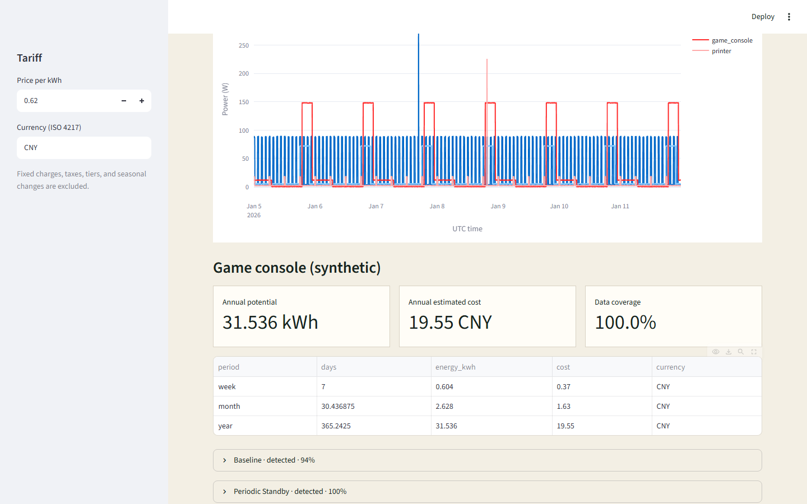
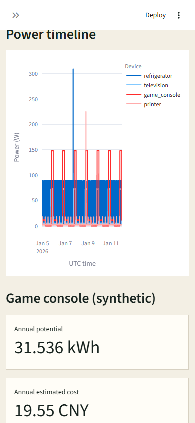

# WattWraith

[](https://github.com/KanadeK/wattwraith/actions/workflows/ci.yml)
[](https://github.com/KanadeK/wattwraith/actions/workflows/security.yml)
[](LICENSE)
[](https://github.com/KanadeK/wattwraith/releases)

**Explainable, offline-first standby and phantom-load analysis for smart-plug time
series.** WattWraith imports CSV or JSON, finds low-power baselines, periodic wake-ups,
sustained overnight draw, and anomalous spikes, then shows the evidence and projects
verifiable energy and tariff savings.



Current status: **v0.1.0 release candidate**

- Local by default: no account, cloud service, telemetry, or external API.
- Reviewable: every result has a rule ID, measured evidence, status, and confidence.
- Actionable but cautious: week/month/year projections and before/after verification;
  essential devices are never presented as safe to switch off.

## Quick start

Python 3.12 is required.

```bash
python -m pip install -e ".[dev]"
wattwraith demo --output-dir wattwraith-demo
streamlit run src/wattwraith/app.py
```

The demo runs the real domain pipeline against 8,064 deterministic readings. For the
synthetic game console at 0.62 CNY/kWh, the current fixture produces:

```text
annual potential:      31.536 kWh
annual estimated cost: 19.55 CNY
data coverage:         100.0%
baseline:              detected, confidence 94%
periodic standby:      detected, confidence 100%
overnight sustained:   detected, confidence 100%
```

Confidence is deterministic evidence strength, not a probability. Projected savings
are straight-line estimates from the covered observation window, not a bill guarantee.

## What WattWraith detects

| Finding | Rule basis | Default savings treatment |
| --- | --- | --- |
| Low-power baseline | Stable, separated low-power state above the approved target | Counts avoidable watts above the target |
| Periodic standby | Repeated state transitions with consistent intervals and autocorrelation | Counts the union of matching intervals |
| Overnight sustained | Covered local-night windows remaining above the target | Counts the union without double-counting other rules |
| Anomaly spike | Robust deviation confirmed by seeded IsolationForest | Diagnostic only; not assumed to be savings |

Each detector returns `detected`, `not_detected`, or `insufficient_data`. Missing data
gaps are not interpolated into fictitious energy. Overlapping detectors use the maximum
avoidable watts per timestamp instead of adding the same energy twice.

## Input

CSV and JSON use the same three required fields:

```csv
timestamp,device_id,watts
2026-01-05T00:00:00Z,television,5.184
2026-01-05T00:05:00Z,television,5.421
```

- `timestamp`: ISO 8601 with an explicit timezone offset
- `device_id`: a user-controlled label, 1–128 characters
- `watts`: finite, non-negative power in watts

Files are limited to 50 MiB. Naive timestamps, missing columns, invalid JSON, negative
power, non-finite values, and unsupported extensions fail with a nonzero CLI status.
No unit guessing is performed.

## CLI

Analyze a local file and write JSON, CSV, and self-contained HTML:

```bash
wattwraith analyze readings.csv \
  --annotations annotations.json \
  --tariff tariff.json \
  --output-dir report
```

Reprice without changing detector logic:

```bash
wattwraith analyze readings.json \
  --annotations annotations.json \
  --price-per-kwh 0.85 \
  --currency CNY \
  --output-dir repriced-report
```

The JSON export contains aggregates, rule evidence, confidence factors,
recommendations, and verification steps. It excludes raw readings and absolute source
paths. CSV cells beginning with spreadsheet formula prefixes are escaped; HTML labels
are escaped.

## Streamlit interface

```bash
streamlit run src/wattwraith/app.py
```

Choose the packaged demo or upload CSV/JSON, review explicit device annotations, set a
flat tariff and approved standby target, then run analysis. The timeline, projections,
finding evidence, safety notes, and three downloads all come from the same domain
service used by the CLI.

The responsive mobile result is also generated from the running application:



## Python API

The domain core has no UI, file, network, or wall-clock dependency:

```python
from decimal import Decimal

from wattwraith.adapters import load_power_file
from wattwraith.domain import DeviceAnnotation, TariffPlan, analyze_device

frame = load_power_file("readings.csv").filter(device_id="television")
report = analyze_device(
    frame,
    DeviceAnnotation(device_id="television", standby_target_w=1.0),
    TariffPlan(currency="CNY", price_per_kwh=Decimal("0.62")),
)
print(report.public_dump())
```

For multiple devices, use `wattwraith.services.analyze_frame`.

## Synthetic sample data

`examples/data/` contains a seven-day, five-minute fixture for a refrigerator,
television, game console, and printer. It is generated with seed `32` by
`scripts/generate_samples.py`, is MIT-licensed, contains no real household data, and is
also packaged for `wattwraith demo`.

```bash
python scripts/generate_samples.py
```

The manifest records row count and SHA-256 for both CSV and JSON. Tests assert that
regeneration is byte-for-byte reproducible and that both formats load equivalently.

## Architecture

```text
CSV / JSON
    │
    ▼
bounded file adapter ──► canonical Polars frame
                              │
                              ▼
                 pure explainable domain rules
                              │
                              ▼
                    immutable Pydantic reports
                      │                  │
                      ▼                  ▼
                CLI / Streamlit     JSON / CSV / HTML
```

See [Architecture](docs/ARCHITECTURE.md) for state segmentation, integration formulas,
confidence semantics, and dependency boundaries.

## Verification

The complete local gate is:

```bash
python -m ruff check .
python -m ruff format --check .
python -m mypy src
python -m pytest -q --cov=src --cov-report=term-missing --cov-fail-under=80
python -m build
```

Cross-platform task entry points:

```bash
make verify
make demo
make package
make release-check
```

On systems without GNU Make, run the corresponding `python scripts/verify.py`,
`demo.py`, `package_release.py`, and `release_check.py` commands. These scripts execute
the real checks and stop on failures.

The suite covers domain rules, exact formulas, state changes, invalid and permission
errors, privacy, CSV/HTML injection, deterministic regeneration, CLI subprocesses, and
Streamlit interactions. See the measured [benchmark](docs/BENCHMARK.md).

## Privacy and safety

- WattWraith performs no network requests or telemetry.
- Device type is user or fixture annotation; it is never inferred from power.
- The project does not infer identity, occupancy, sleep, work, or personal behavior.
- Raw time series can reveal routines. Treat user exports as private.
- An essential device cannot be marked safe for automatic shutdown.
- An anomaly can be a legitimate start-up surge; it is not counted as savings.

Read the complete [privacy and security model](docs/PRIVACY_AND_SECURITY.md).

## Non-goals for v0.1.0

- Direct control of a smart plug or automatic power cutoff
- Appliance identification from aggregate household meters
- Time-of-use, demand, tax, fixed-fee, or seasonal tariff modeling
- Billing, electrical-safety certification, or guaranteed savings
- Cloud storage, remote monitoring, or household-behavior inference

## Differentiation

A dated public-repository sample found no active project with both the same name and a
highly isomorphic scope. Adjacent tools generally focus on hardware collection,
dashboards, or aggregate-meter NILM. WattWraith concentrates on offline device-level
forensics with explicit rules, evidence, confidence, tariff repricing, and a
before/after verification plan. This is an intentionally narrow sampled-search claim,
not a global uniqueness claim. See [the scan](docs/COMPETITOR_SCAN.md).

## Roadmap

- v0.2: user-defined detector profiles and time-of-use tariff adapters
- v0.3: local-only Home Assistant import adapter
- Later: seasonal comparison with explicit uncertainty and opt-in encrypted storage

## Contributing and security

Read [CONTRIBUTING.md](CONTRIBUTING.md), the
[Code of Conduct](CODE_OF_CONDUCT.md), and [SECURITY.md](SECURITY.md). Use GitHub's
private vulnerability reporting for sensitive findings. Do not attach real household
traces to a public issue.

## FAQ

**Does WattWraith identify appliances or people?**

No. Device type comes from an explicit annotation, and sensitive behavior inference is
outside the project boundary.

**Why can a finding be detected with less than 100% confidence?**

Confidence summarizes coverage, stability, separation, and rule support. It is not a
calibrated probability.

**Why is the yearly estimate different from my bill?**

v0.1.0 uses a flat energy price and straight-line projection. It excludes fixed charges,
taxes, tiers, demand charges, seasons, and unrelated consumption.

**Can it safely switch off my refrigerator?**

No. WattWraith does not control devices. Essential annotations suppress automation
language and preserve monitoring-only recommendations.

## License

[MIT](LICENSE) © 2026 KanadeK
